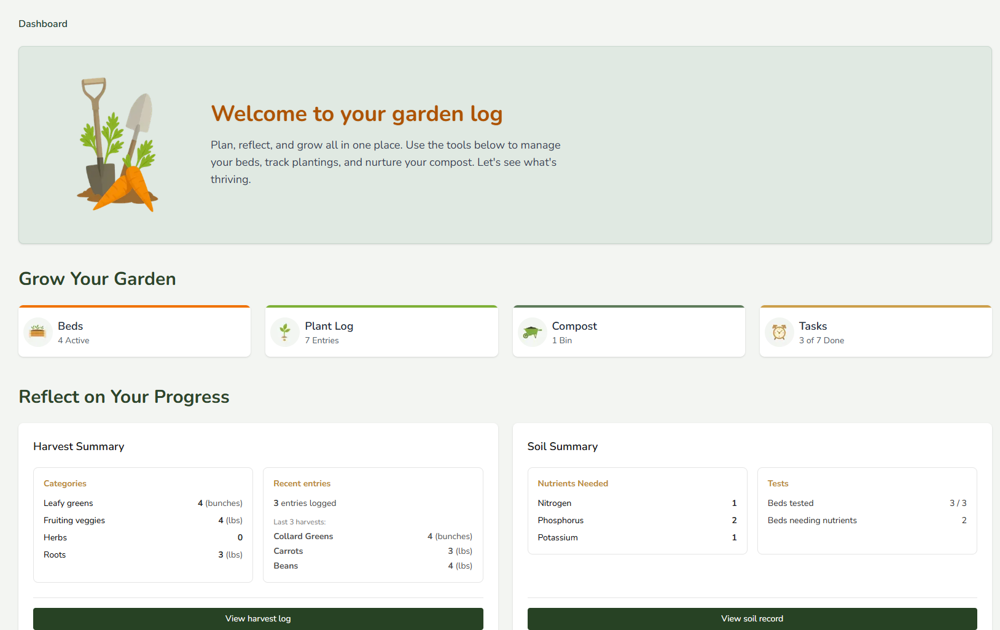
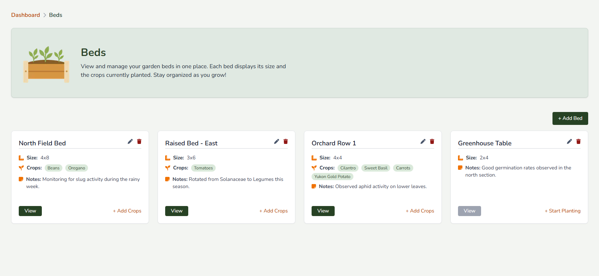
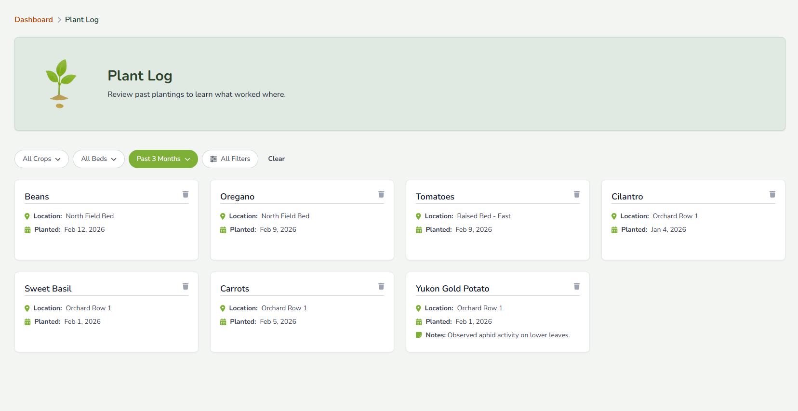
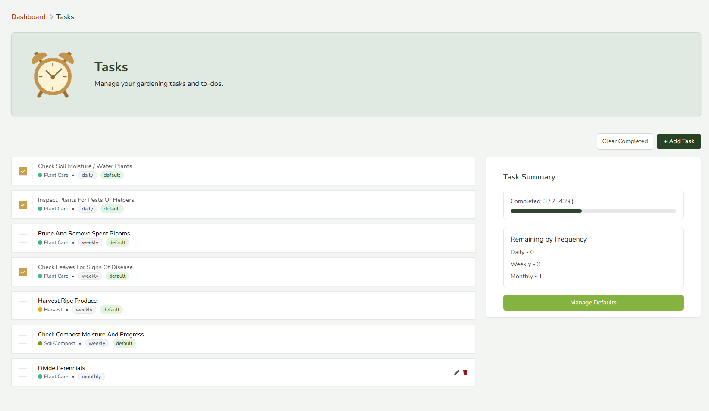
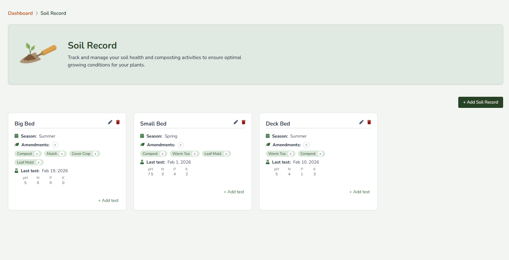

# Grow & Tell 🌱

Grow & Tell is a frontend-focused garden planning application for tracking beds, crops, tasks, harvests, compost activity, and soil health in one cohesive dashboard.

The project was built as a long-running personal app with an emphasis on UX clarity, accessibility, and maintainable state management.

## What It Does

Grow & Tell helps home gardeners:

- Manage garden beds and planted crops
- Track harvests and planting history
- Plan and complete recurring gardening tasks
- Record soil amendments (including compost activity) and soil test results
- View summaries and details through card- and modal-based flows

The app is designed around real-world gardening workflows, with intentional empty states, disabled actions, and progressive disclosure of detail.

## Tech Stack

- **Next.js** with **TypeScript**
- **React Context** for state management
- **Tailwind CSS** for styling
- Accessibility-first UI patterns (keyboard navigation, focus management, ARIA where appropriate)

## Key Features

- Responsive dashboard layout
- Add, edit, and delete beds, crops, and tasks
- Modal-based CRUD flows with consistent interaction patterns
- Derived state and real-time UI updates via context
- Harvest summaries grouped by category
- Soil tracking using banded test inputs that reflect real garden test kits
- Careful handling of empty and edge states

## Scope & Decisions

- No authentication or backend integration
- Data is stored locally in the browser
- The app prioritizes core gardening workflows over auxiliary features to keep the experience focused and maintainable.

These decisions prioritize clarity, UX quality, and long-term maintainability over feature breadth.

## User Guide

See [USER_GUIDE.md](./USER_GUIDE.md) for a walkthrough of app features and workflows.

## Screenshots

### Dashboard

### Beds

### Plant Log

### Tasks

### Soil

